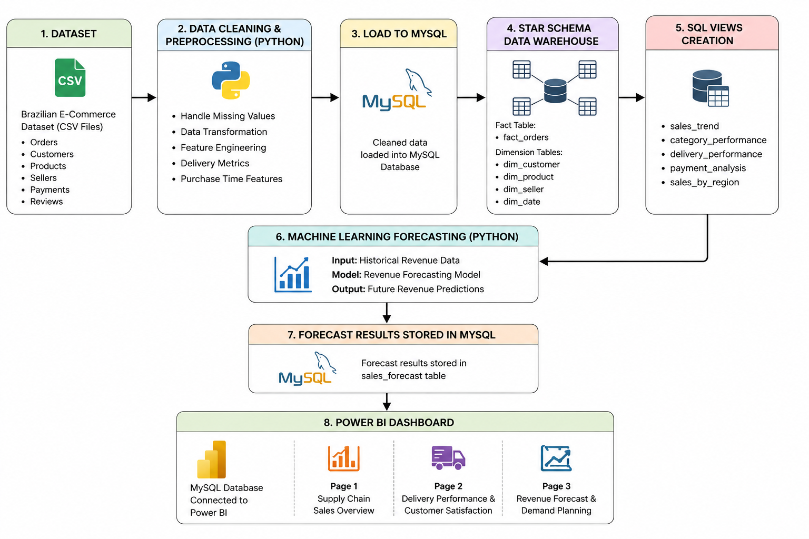
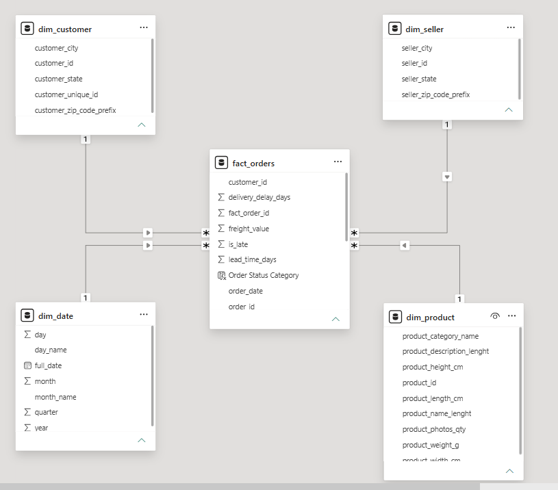
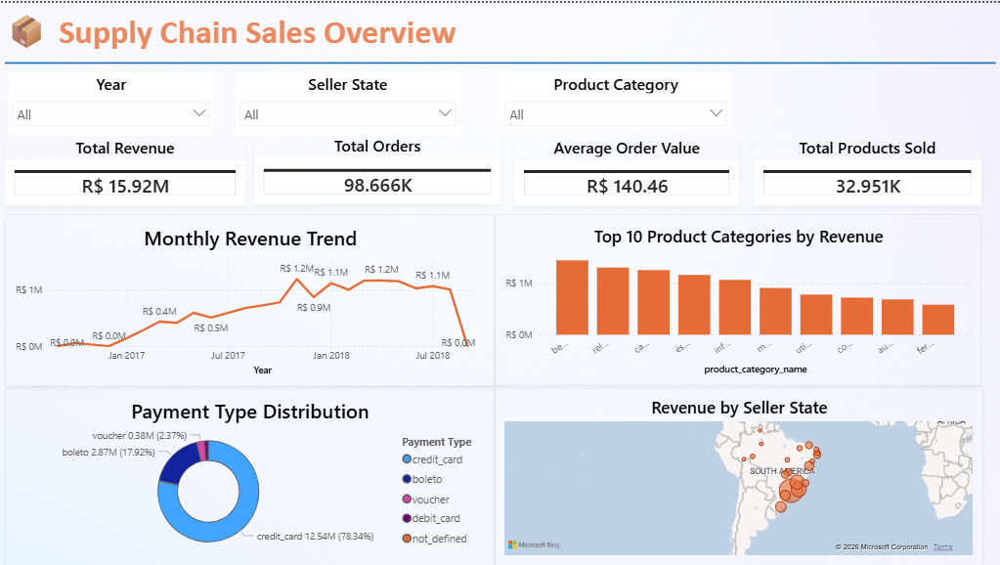
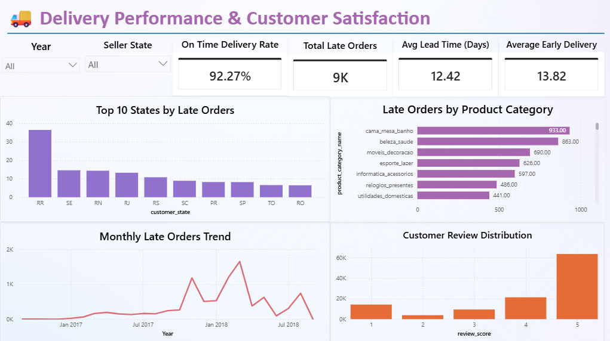
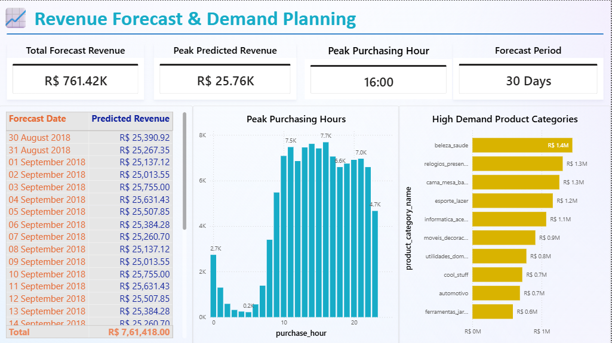

# 📦 Supply Chain Analytics Pipeline


---

## 📌 Project Overview

An end-to-end supply chain analytics pipeline built on 100K+ real Brazilian e-commerce orders from the Olist dataset. The project covers the complete data analyst workflow — raw CSV ingestion, data cleaning, star schema data warehouse design in MySQL, 30-day revenue forecasting using Linear Regression, and an executive Power BI dashboard with 3 focused pages.

**Business Problems this project solves:**
- How is revenue trending and which products drive the most sales?
- Which regions and product categories have the worst delivery performance?
- What will revenue look like in the next 30 days?

---

## 🏗️ Architecture



The pipeline is structured into 4 layers:

**1. Data Engineering Layer — Python & Pandas**
8 raw CSV files are individually cleaned, missing values handled, duplicates removed, and key features engineered — delivery delay, lead time, total sales, and purchase time features. Cleaned data is pushed to MySQL via SQLAlchemy as staging tables.

**2. Data Warehouse Layer — MySQL**
Staging tables are transformed into a Star Schema consisting of one central fact table (fact_orders) and four dimension tables (dim_customer, dim_product, dim_seller, dim_date). Window functions and SQL views are built on top of the warehouse to power the analytics and BI layer.

**3. Machine Learning Layer — Python & Scikit-Learn**
A Linear Regression model pulls data directly from MySQL, trains on historical daily revenue, forecasts the next 30 days of demand, and stores the predictions back into MySQL as a forecast table.

**4. Business Intelligence Layer — Power BI**
Power BI connects exclusively to MySQL and consumes fact tables, dimension tables, and views to render a 3-page executive dashboard with interactive slicers and DAX measures.

### Star Schema Design

Designed a Star Schema Data Warehouse in MySQL using fact and dimension tables to support business intelligence reporting and analytics.



---

## 🛠️ Tech Stack

| Layer | Tools |
|---|---|
| Data Cleaning | Python · Pandas |
| Database | MySQL · SQLAlchemy |
| Data Modeling | Star Schema · SQL Views · Window Functions |
| Machine Learning | Scikit-Learn · Linear Regression |
| Visualization | Power BI · DAX |

---

## 📦 Dataset

**Brazilian E-Commerce Public Dataset by Olist**
🔗 [Download from Kaggle](https://www.kaggle.com/datasets/olistbr/brazilian-ecommerce)

A real-world Brazilian e-commerce dataset containing 100K+ orders placed between 2016 and 2018. It covers the full order lifecycle — from purchase to delivery — including customer information, product details, seller data, payments, and reviews across 8 CSV files.

---

## 📁 Project Structure

```
supply-chain-analytics-pipeline/
│
├── README.md
├── .gitignore
├── requirements.txt
│
├── notebooks/
│   ├── Data_Cleaning.ipynb          ← cleaning + feature engineering + push to MySQL
│   └── Sales_Forecasting.ipynb      ← ML model + forecast table push to MySQL
│
├── sql/
│   ├── 01_verify_staging.sql        ← sanity check on staging tables
│   ├── 02_create_dimensions.sql     ← dim_customer, dim_product, dim_seller, dim_date
│   ├── 03_create_fact.sql           ← fact_orders with feature engineering
│   ├── 04_add_keys.sql              ← primary keys and foreign keys
│   ├── 05_window_functions.sql      ← rolling avg, LAG, RANK queries
│   ├── 06_aggregations.sql          ← revenue by month, state, category
│   ├── 07_views_powerbi.sql         ← views for Power BI layer
│   └── 08_validation.sql            ← final row counts and null checks
│
└── images/
    ├── architecture.png
    ├── star_schema.png
    ├── dashboard_page1.png
    ├── dashboard_page2.png
    └── dashboard_page3.png
```

---

## 📊 Dashboard

### Page 1 — Sales Overview
Provides a high-level view of overall business performance. KPI cards show total revenue, total orders, average order value, and total products sold. A monthly revenue trend line tracks growth over time, a bar chart ranks the top 10 product categories by revenue, a donut chart breaks down payment type distribution, and a map visual shows revenue concentration by seller state across Brazil.



---

### Page 2 — Delivery Performance & Customer Satisfaction
Focuses on operational and logistics performance. KPI cards show on-time delivery rate, total late orders, average lead time, and average early delivery days. A bar chart identifies the top 10 states by late order count, a horizontal bar chart highlights which product categories have the most late deliveries, a line chart tracks monthly late order trends over time, and a bar chart shows customer review score distribution.



---

### Page 3 — Revenue Forecast & Demand Planning
Presents the output of the Linear Regression forecasting model. KPI cards display total forecast revenue, peak predicted daily revenue, peak purchasing hour, and forecast period. A detailed table lists daily predicted revenue for the next 30 days, a bar chart shows the top high-demand product categories by historical revenue, and a bar chart of peak purchasing hours helps identify when customers are most active.



---

## 💡 Key Insights

**Q1: How is revenue trending and which products drive the most sales?**

- Revenue grew consistently through 2017, peaking at **R$ 1.2M in November 2017** — driven by Black Friday demand
- **Health & Beauty (beleza_saude)** is the top revenue category at R$ 1.4M+, followed by watches and home decor
- Total platform revenue across 2016–2018 reached **R$ 15.92M** across 98,666 orders
- Average order value stands at **R$ 140.46** with credit card dominating at **78.34%** of all transactions

---

**Q2: Which regions and product categories have the worst delivery performance?**

- Overall on-time delivery rate is strong at **92.27%** — only 9K orders out of 98K+ were late
- **State RR (Roraima)** has the highest late order count — indicating a northern Brazil logistics gap
- **cama_mesa_banho (Bed & Bath)** leads late orders by product category with 933 late deliveries
- Average lead time from purchase to delivery is **12.42 days** across all states

---

**Q3: What will revenue look like in the next 30 days?**

- The Linear Regression model forecasts **R$ 761K in total revenue** over the next 30 days
- Peak predicted daily revenue is **R$ 25.76K**
- Peak purchasing activity occurs at **16:00** — afternoon hours drive the most orders

---

## 🤖 ML Model Performance

| Metric | Score | Meaning |
|---|---|---|
| R² Score | 0.887 | Model explains 88.7% of revenue variance |
| MAE | 3269.5 | Average prediction error of R$ 3,269 per day |
| RMSE | 4301.55 | Root mean squared error of R$ 4,301 |

Model achieves 88.7% accuracy on historical revenue data, making it reliable for short-term demand planning.

---

## ⚙️ How To Run

### 1. Clone the repository
```bash
git clone https://github.com/yourusername/supply-chain-analytics-pipeline.git
cd supply-chain-analytics-pipeline
```

### 2. Install dependencies
```bash
pip install -r requirements.txt
```

### 3. Download the dataset
Download from [Kaggle](https://www.kaggle.com/datasets/olistbr/brazilian-ecommerce) and place CSV files in a local `data/raw/` folder.

### 4. Configure database credentials
Create a `.env` file in the project root with your MySQL credentials.

### 5. Create MySQL database
```sql
CREATE DATABASE supply_chain_dw;
USE supply_chain_dw;
```

### 6. Run notebooks in order
```
1. notebooks/Data_Cleaning.ipynb
2. notebooks/Sales_Forecasting.ipynb
```

### 7. Run SQL files in order
Open MySQL Workbench and execute files from the `sql/` folder in numerical order (01 → 08).

---

## 👤 Author

**Your Name**
- 🔗 [LinkedIn](https://linkedin.com/in/yourprofile)
- 🐙 [GitHub](https://github.com/yourusername)